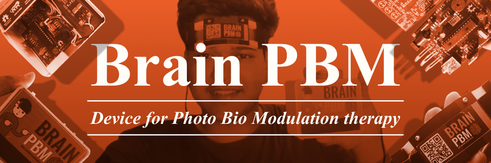

   

    

# BRAIN PBM - a device for photo bio modulation therapy.
This project aims at making an affordable yet powerful **Photobiomodulation Therapy Device** to **repair and heal** the damaged cells. This device is a prototype to be used for healing psychiatric disorders like depresssion and anxity. The device would be primarily used for teaching and animal study at NIT Rourkela, Odisha India.

### Objective
| Objective | Status |
|:-------:| :-------: |
| Design and Fabrication of (830nm) NIR Device for Photo-Biomodulation (PBM therapy ). |  |
| Validation of the effect of monochromatic (830nm) NIR device in counter measuring Affective Disorder in animal model (Zebra Fish) |  | 
| Comparison of effects of continuous PBM versus pulsatile PBM in treatment |  |

### Documentation

| Document | Presentation | Poster |
|:-------:| :-------: | :-------: |
| [DOWNLOAD](/Documentation/Shreenandan%20Sahu%20120BM0806.pdf) | [DOWNLOAD](/Documentation/120BM0806%20Shreenandan%20Sahu.pdf) | [DOWNLOAD](/Documentation/STW%20Poster%20Presentation%20Shreenandan%20Sahu.pdf) |

### Electronics 
| PCB | Schematics |
| :-------------------------------------------: | :-------------------------: |
|   |   |

### 3D Designed Units

| Head Unit | Control Unit |
| :-------------------------------------------: | :-------------------------: |
|   |   |

### Final Product

| Human Head Unit | Pocket Unit |
| :-------------------------------------------: | :-------------------------: |
|   |   |

| RED LED | 830nm LED |
| :-------------------------------------------: | :-------------------------: |
|   |   |

### APP UI and structure

### Poster Presentation

  